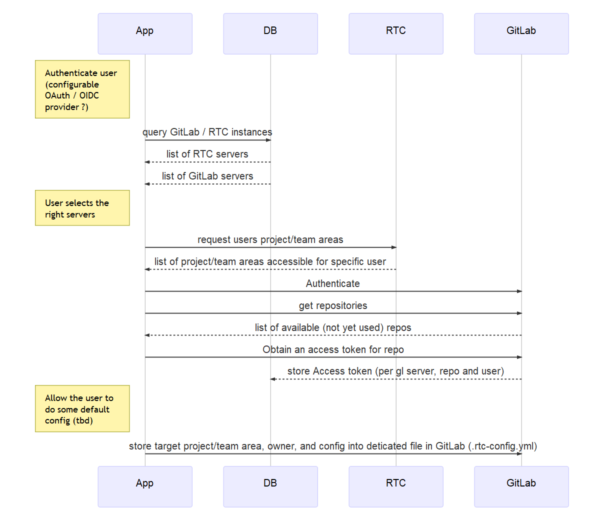

# Use mermaid to generate charts from text
Just some simple play around to determine whether mermaid would be suitable for generating charts to outline our requirements for [RTC Gitlab Collaborator](https://github.com/jazz-community/rtc-gitlab-collaborator).

## Setup
Install `mermaid`:
> npm install -g mermaid

Install PhantomJS (not required on travis):
> npm install -g phantomjs

## Writing Chart `code`
If you are not an expert in writing mermaid yet, use the provided [Live Editor](https://knsv.github.io/mermaid/live_editor/) to see immediate results!

## Generate Images
> cd docs/models

> ./generate-images.sh

## Result
That's how a generated result looks like:

